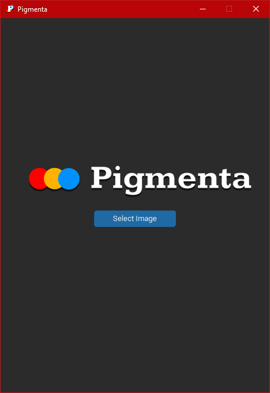

<p align="center">
  
</p>

# Pigmenta

Pigmenta is a simple desktop application built with Python to help you discover the three most dominant colors in any image. The app uses the K-Means algorithm to analyze the image's pixels and identify the most prominent color palette, which you can then save to your computer.

<p align="left">
  
</p>

## Key Features

- Select an Image: Easily upload any image from your computer.
- Extract Colors: Automatically extracts the top three dominant colors from the uploaded image.
- Display Palette: Shows the extracted color palette in a clean, visual format.
- Download Palette: Save the color palette for use in your own projects.

## Technology Stack

- Python: The main programming language.
- CustomTkinter: Used for building the modern and attractive graphical user interface (GUI).
- scikit-learn: Provides the K-Means algorithm for color clustering.
- Pillow (PIL): Used for processing and manipulating image data.
- Numpy: Handles efficient numerical operations on the image data.

## How to Use
1. Installation: Make sure you have **Python 3.11** installed on your system.

2. Clone the Repository:
```bash
git clone https://github.com/seymourrisey/pigmenta.git
cd pigmenta
```
(Optional) create a virtual environtment
```bash
python -m venv venv
venv\Scripts\activate  
```
3. Install Dependencies:
```bash
pip install requirements.txt
```

4. Run the application:
```bash
python main.py
```

## Contributing

We welcome contributions! If you find a bug or have an idea for a new feature, please feel free to open an issue or submit a pull request.

## License
This project is licensed under the MIT License.
